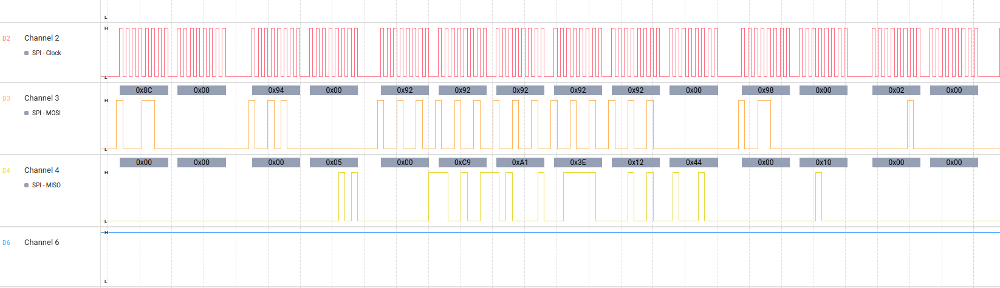

# Linux Embedded Access Control System (C/Python)

A production-grade, distributed RFID access control system. This project features a custom-built MFRC522 driver, a decoupled C-daemon architecture, and a Python-based security engine.

## 🛠 Project Architecture
The system is built on a **Distributed Services** model, separating hardware-critical tasks from high-level business logic:

1. **Hardware Engine (`libmfrc522.so`)**: 
   - A low-level C driver implemented as a **Linux Userspace Driver**.
   - Interfaces with the hardware via **SPI Syscalls (`ioctl`)** using `spidev`.
   - Performs **Register-level manipulation** of the MFRC522 (Bit-Framing, Timer setup, Antenna gain).
   - Manages manual **CRC-16** calculation and **MIFARE Crypto1** authentication.
2. **Service Layer (`rfid_daemon`)**: 
   - A C-based system daemon managing the SPI bus lifecycle.
   - Decouples hardware from logic via a **Unix Domain Socket** IPC.
3. **Logic Layer (`gateKeeper.py`)**: 
   - Python security engine consuming the raw socket stream.
   - Validates UIDs against **SQLite3** whitelists and manages asynchronous audit logging.
4. **Deployment (`systemd`)**: 
   - Managed by systemd units for boot-start, crash recovery, and sandboxed execution.

## 📂 Project Structure
```text
/RFID_Project
├── /include             # Header files (SPI.h, MFRC522.h, status.h)
├── /src                 # Implementation (SPI.c, MFRC522.c)
├── Makefile             # Multi-target build system for .so and binaries
├── main.c               # Admin Tool (Conditional Compilation: Read/Write)
├── rfid_daemon.c        # C Socket Server (The Hardware Service)
├── gateKeeper.py        # Python Socket Client (The Logic Engine)
├── createDatabase.py    # Database initialization script
├── rfid_hw.service      # Systemd Hardware Unit
├── rfid_logic.service   # Systemd Logic Unit
├── docs                 # Hardware Verification
├── .gitignore           # File exclusion rules
├── LICENSE              # MIT License
└── README.md            # Documentation

##  Hardware Verification
To ensure SPI timing and signal integrity, the driver was verified using a **Logic Analyzer**. 
The screenshots below confirm the 1MHz clock stability and the MOSI/MISO handshake during a MIFARE Authenticate command.




📋 Installation & Deployment
Build System:
make (Generates the Shared Library and binaries with RPATH linking)
Initialize Databases:
python3 createDatabase.py
Install System Services:
bash
sudo cp *.service /etc/systemd/system/
sudo systemctl daemon-reload
sudo systemctl enable --now rfid_hw.service rfid_logic.service
Use code with caution.

Monitor System Logs:
sudo journalctl -u rfid_hw -u rfid_logic -f


📚 References & Resources
Datasheet: NXP MFRC522 Official Data Sheet
Technical Guide: MFRC522 Module Deep-Dive (GetToByte)
Linux SPI Development: The Linux Kernel SPI Documentation
